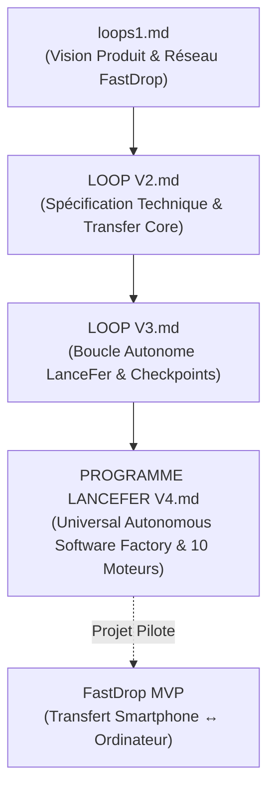
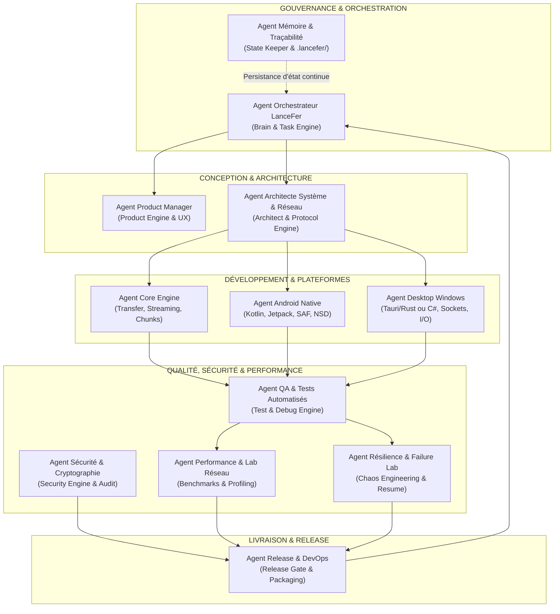

# SYSTÈME MULTI-AGENTS LANCEFER & PROJET FASTDROP
## Analyse des Spécifications et Cartographie des Agents Autonomes

---

## 1. Synthèse et Analyse Comparative des Fichiers du Répertoire

Le dossier contient quatre documents fondamentaux qui retracent une maturation architecturale progressive, passant d'un prompt d'ingénierie ciblé vers une véritable **Software Factory universelle et autonome**.

### 1.1 `loops1.md` — La Genèse du Produit FastDrop
* **Nature** : Cahier des charges fonctionnel et technique initial.
* **Focus** : Transfert de fichiers ultra-rapide entre Smartphone (Android) et Ordinateur (Windows/Linux/macOS) en réseau local direct (sans transit par le cloud).
* **Piliers établis** :
  * Ordre de priorité strict : **Vitesse > Fiabilité > Simplicité > Sécurité > Compatibilité > Design**.
  * Découverte automatique (mDNS, UDP broadcast, QR Code).
  * Streaming par découpage en blocs (chunking) sans saturation mémoire.
  * Reprise obligatoire après interruption (Resume à 87% sans repartir de zéro).
  * Validation d'intégrité (SHA-256).

### 1.2 `LOOP V2 — Agent de développement FastDrop.md` — La Spécification Modulaire
* **Nature** : Guide d'ingénierie logicielle spécialisé et approfondi.
* **Focus** : Formalisation de l'architecture découplée avec le concept central de **Transfer Core**.
* **Apports majeurs** :
  * Découplage strict entre l'UI et la logique métier.
  * Définition rigoureuse du protocole applicatif (états de session : `DISCOVER`, `PAIR_REQUEST`, `TRANSFER_REQUEST`, `CHUNK`, `CHUNK_ACK`, `TRANSFER_RESUME`, `CHECKSUM`, etc.).
  * Gestion de la contre-pression (*backpressure*) pour éviter l'épuisement RAM sur les écarts de débit réseau/stockage.
  * Algorithme de parallélisme adaptatif (*AdaptiveParallelism*).
  * Intégration du *Failure Lab* (tester activement les pannes et pertes réseau).

### 1.3 `LOOP V3 — Programme LanceFer — Autonomous Build Loop.md` — L'Orchestration Autonome
* **Nature** : Protocole d'autonomie et d'exécution logicielle.
* **Focus** : Comment un agent logiciel peut construire le projet de manière indépendante et itérative.
* **Apports majeurs** :
  * Boucle opérationnelle : `OBSERVE → UNDERSTAND → PLAN → IMPLEMENT → TEST → MEASURE → VERIFY → DOCUMENT → CHECKPOINT`.
  * Persistance de l'état du projet via le dossier `.lancefer/` (`state.json`, `decisions.json`, `tasks.json`, `blockers.json`, `metrics.json`).
  * Hiérarchie de vérité : **Tests > Code > Documentation > Hypothèses**.
  * Structuration par jalons séquentiels (*Milestones* M01 à M07).

### 1.4 `PROGRAMME LANCEFER V4 — Universal Autonomous Software Factory.md` — L'Usine Logicielle Universelle
* **Nature** : Master System Prompt généraliste de niveau industriel.
* **Focus** : Découpage de l'agent en **10 moteurs spécialisés** (Engines) capables de traiter n'importe quel projet logiciel, avec FastDrop comme banc d'essai pilote.
* **Apports majeurs** :
  * Règle absolue de vérité : Ne jamais confondre code écrit et fonctionnalité vérifiée.
  * Les 10 moteurs : Brain, Product, Architect, Task, Build, Test, Debug, Research, Memory, Release.
  * Mécanismes anti-hallucination et anti-gold-plating (ne pas sur-complexifier).
  * Sas de validation final strict (*Release Gate* GO / NO-GO).

---

## 2. Définition du Système Multi-Agents pour le Projet

Pour concrétiser cette vision sans saturer un agent unique sous une charge cognitive excessive, le travail doit être distribué entre des **agents spécialisés**, chacun dédié à un domaine d'expertise, coordonnés par un **Superviseur Central**.

---

## 3. Fiches Détaillées des Agents

### 3.1 Pôle Gouvernance & Pilotage

#### 👑 Agent 1 : LANCEFER-ORCHESTRATEUR (Master Brain & Task Dispatcher)
* **Origine dans les fichiers** : *Engine 01 (Brain)*, *Engine 04 (Task)*, *Engine 07 (Debug)* de V4, boucle de V3.
* **Mission** : Coordonner l'ensemble du cycle de développement, arbitrer les choix techniques, ordonnancer les tâches et piloter la machine à états (`PENDING` → `READY` → `IN_PROGRESS` → `VERIFIED`).
* **Responsabilités clés** :
  * Décomposer les jalons (Milestones) en sous-tâches exécutables et testables.
  * Déclencher la boucle autonome : *Observe → Plan → Implement → Test → Verify → Checkpoint*.
  * Gérer les blocages critiques et déclencher les escalades vers l'utilisateur si nécessaire.
  * Maintenir le respect de la règle d'or : *Ne pas simuler le travail, exiger des preuves d'exécution*.
* **Entrées** : Objectif global utilisateur, état actuel du repo.
* **Sorties** : Ordres de travail aux agents spécialisés, rapports de jalons (*Milestone Reports*).

#### 📚 Agent 2 : LANCEFER-MEMORY (State & Traceability Keeper)
* **Origine dans les fichiers** : *Engine 09 (Memory)* de V4, section 4 de V3.
* **Mission** : Garantir la persistance et la fidélité de l'état du projet dans `.lancefer/`.
* **Responsabilités clés** :
  * Mettre à jour en temps réel `state.json`, `decisions.json` (ADRs), `tasks.json`, `blockers.json` et `metrics.json`.
  * Sauvegarder les *Checkpoints* après chaque validation de sous-système.
  * Permettre la reprise autonome (*Autonomous Resume*) en cas d'interruption sans perte d'historique.
  * Suivre et catégoriser la dette technique (Low / Med / High / Critical).

---

### 3.2 Pôle Spécifications & Architecture

#### 🎯 Agent 3 : PRODUCT-OWNER (Spécifications, Scope & UX)
* **Origine dans les fichiers** : *Engine 02 (Product)*, *Engine 24 (UX)* de V4, section 4 de `loops1.md`.
* **Mission** : Définir le périmètre fonctionnel du MVP FastDrop, le parcours critique et les critères de succès.
* **Responsabilités clés** :
  * Établir le *Product Brief* et les critères d'acceptation de chaque user story.
  * Cartographier le *Golden Path* : `Découverte → Appairage → Sélection → Envoi → Réception → Vérification`.
  * Empêcher le *Gold-Plating* (refuser les fonctionnalités superflues qui retardent le MVP).
  * Définir l'ergonomie (états vides, feedback de progression, notifications, gestion des erreurs compréhensibles).

#### 🏛️ Agent 4 : SYSTEM-ARCHITECT (Protocoles & Architecture Système)
* **Origine dans les fichiers** : *Engine 03 (Architect)* de V4, sections 5-8 de `LOOP V2.md` et `loops1.md`.
* **Mission** : Concevoir l'architecture modulaire découpée et le protocole de communication FastDrop.
* **Responsabilités clés** :
  * Spécifier le protocole réseau FastDrop v1 (format binaire/JSON, trames de contrôle, encodage des messages).
  * Définir la machine à états de session et la négociation des capacités (*Capabilities Negotiation*).
  * Rédiger les décisions d'architecture formelles (ADR : choix de la pile de transport TCP vs QUIC, mDNS vs UDP broadcast, etc.).
  * Découpler rigoureusement le *Transfer Core* de toutes les couches d'interface utilisateur.

---

### 3.3 Pôle Ingénierie & Implémentation

#### ⚡ Agent 5 : CORE-TRANSFER-ENGINEER (Moteur Bas Niveau & Réseau)
* **Origine dans les fichiers** : Sections 9-16 de `LOOP V2.md`, *Engine 05 (Build)* de V4.
* **Mission** : Implémenter le cœur de transfert indépendant de la plateforme (*Transfer Core*).
* **Responsabilités clés** :
  * Moteur de streaming par blocs (*ChunkEngine*) sans chargement complet en RAM.
  * Gestionnaire de contre-pression (*Backpressure*) pour synchroniser lecture disque, buffer socket et écriture disque.
  * Gestionnaire de reprise (*ResumeEngine*) s'appuyant sur un manifeste de chunks persisté.
  * Contrôle d'intégrité cryptographique en continu (hachage SHA-256 par chunk et global).
  * Gestionnaire de connexions parallèles adaptatives (*AdaptiveParallelism*).

#### 📱 Agent 6 : ANDROID-ENGINEER (Plateforme Mobile)
* **Origine dans les fichiers** : Spécifications Android dans `loops1.md` et `LOOP V2.md`.
* **Mission** : Développer l'application native Android FastDrop.
* **Responsabilités clés** :
  * Implémentation en Kotlin moderne avec Coroutines et Flow.
  * Intégration du *Storage Access Framework (SAF)* pour la manipulation sécurisée et fluide des fichiers volumineux.
  * Implémentation de la découverte locale via Android *Network Service Discovery (NSD / mDNS)* ou Wi-Fi Direct.
  * Gestion des contraintes d'arrière-plan (Foreground Services, WakeLocks pour éviter la coupure du transfert lors de la veille).
  * Interface mobile ergonomique et légère.

#### 💻 Agent 7 : DESKTOP-ENGINEER (Plateforme Windows / Desktop)
* **Origine dans les fichiers** : Spécifications Desktop dans `LOOP V2.md` et `LOOP V3.md`.
* **Mission** : Développer l'application Desktop (priorité Windows, extensible Linux/macOS).
* **Responsabilités clés** :
  * Implémentation de la couche applicative desktop (recommandation : Rust/Tauri ou C#/.NET moderne pour la vitesse I/O).
  * Gestion de l'écoute socket locale, configuration du pare-feu Windows et permissions de découverte réseau.
  * Intégration transparente au système de fichiers (dossier de réception, gestion des fichiers volumineux > 10 GB).
  * Interface desktop fluide affichant les débits temps réel, les pairs connectés et l'historique des transferts.

---

### 3.4 Pôle Qualité, Sécurité & Performance

#### 🧪 Agent 8 : QA-TEST-ENGINEER (Validation & Non-Régression)
* **Origine dans les fichiers** : *Engine 06 (Test)* de V4, section 13 de `LOOP V3.md`.
* **Mission** : Concevoir et exécuter la suite de tests automatisés.
* **Responsabilités clés** :
  * Tests unitaires sur les composants critiques (découpeur de chunks, validateurs de protocole, sérialisation).
  * Tests d'intégration entre le client et le serveur simulés en local.
  * Tests End-to-End du *Golden Path*.
  * Vérification de la *Definition of Done* avant tout marquage d'une tâche à `VERIFIED`.

#### 💥 Agent 9 : FAILURE-LAB-ENGINEER (Résilience & Chaos Engineering)
* **Origine dans les fichiers** : *Engine 22 (Failure Lab)* de V4, section 21 de `LOOP V2.md`.
* **Mission** : Éprouver le système dans les conditions les plus hostiles pour garantir sa robustesse.
* **Responsabilités clés** :
  * Simuler des interruptions brutales de connexion à divers pourcentages (20%, 50%, 87%, 99%).
  * Injecter des paquets corrompus, des chunks altérés et des timeouts réseau.
  * Valider que la reprise (*Resume*) s'exécute sans régression ni corruption du fichier final.
  * Tester les cas limites : disque récepteur plein, droits d'accès refusés, extinction brutale de l'application.

#### 🔒 Agent 10 : SECURITY-AUDITOR (Chiffrement, Appairage & Hardening)
* **Origine dans les fichiers** : *Engine 23 (Security)* de V4, section 12 de `LOOP V2.md`.
* **Mission** : Verrouiller la sécurité des échanges et des données.
* **Responsabilités clés** :
  * Mettre en œuvre le protocole d'appairage sécurisé (code PIN court ou QR Code, échange de clés sans tiers de confiance).
  * Chiffrement de session de bout en bout (TLS local / Noise Protocol / AES-GCM).
  * Prévention absolue des vulnérabilités de traversée de répertoire (*Path Traversal* dans les noms de fichiers reçus).
  * Validation stricte et assainissement (*sanitization*) de toutes les entrées réseau.

#### 📊 Agent 11 : PERFORMANCE-ENGINEER (Benchmarks & Optimisation)
* **Origine dans les fichiers** : *Engine 21 (Performance)* et section 48 de V4, section 10 de `loops1.md`.
* **Mission** : Mesurer, profiler et maximiser le débit réel de transfert.
* **Responsabilités clés** :
  * Établir des métriques de référence (*Baselines*) sur fichiers de 100 Mo, 1 Go, 5 Go et 10 Go.
  * Profiler l'empreinte mémoire RAM, l'usage CPU et la bande passante I/O.
  * Évaluer scientifiquement les gains du multi-flux (1, 2, 4, 8 flux) vs contention I/O.
  * Appliquer la règle : *Ne jamais optimiser sur intuition, mais uniquement après mesure comparative*.

---

### 3.5 Pôle Déploiement & Clôture

#### 🚀 Agent 12 : RELEASE-GATEKEEPER (Packaging & Validation Finale)
* **Origine dans les fichiers** : *Engine 10 (Release)*, *Engine 35 (Release Gate)* et section 37 de V4.
* **Mission** : Préparer les livrables finaux et prononcer le verdict d'éligibilité à la release.
* **Responsabilités clés** :
  * Génération des binaires finaux (APK Android, installeur ou exécutable portable Windows).
  * Audit du sas de validation (*Release Gate*) : vérification qu'aucun test critique n'a échoué et qu'aucun blocage n'est masqué.
  * Prononcer l'arbitrage formel : **GO** ou **NO-GO** (avec justification technique détaillée).
  * Rédaction du *Final Build Report* et du *Changelog* selon la nomenclature sémantique (SemVer).

---

## 4. Matrice de Collaboration & Protocole de Transition

Pour que les 12 agents collaborent efficacement sans confusion de rôle, les interactions s'organisent en 5 phases séquentielles régies par l'Orchestrateur :

| Phase | Agents Principaux Actifs | Livrable Produit | Critère de Passage à la Phase Suivante |
|---|---|---|---|
| **1. Cadrage & Architecture** | Orchestrateur, Product Owner, Architecte Système, Mémoire | Spécification FastDrop MVP + ADR Protocol v1 + Structure `.lancefer/` | Architecture validée, Golden Path documenté |
| **2. Core Engine & Réseau** | Core Transfer Engineer, Architecte, QA Test Engineer | Moteur Transfer Core indépendant avec streaming, chunking & tests unitaires | Tests unitaires à 100% sur le chunking & l'intégrité SHA-256 |
| **3. Implémentation Plateformes** | Android Engineer, Desktop Engineer, Core Transfer Engineer | Application Android native + Application Windows fonctionnelles | Appairage réussi et transfert local fonctionnel en environnement nominal |
| **4. Épreuve de Robustesse & Perf** | Failure Lab, Security Auditor, Performance Engineer, QA | Rapports de crash-test, audit de sécurité, benchmarks comparatifs | Reprise sur panne vérifiée à 100%, 0 faille critique, débit validé |
| **5. Sas de Release & Clôture** | Release Gatekeeper, Orchestrateur, Mémoire | Binaires APK / EXE + Final Build Report + Checkpoint final | Arbitrage **GO** formel selon les critères du Release Gate |

---

## 5. Règles Opérationnelles Transverses (Invariants LanceFer)

Tous les agents doivent impérativement respecter les règles non négociables extraites de V4 :

1. **Règle absolue de vérité** : Ne jamais prétendre qu'un test est réussi ou qu'un transfert fonctionne sans en avoir exécuté le test et produit la preuve concrète.
2. **Anti-Hallucination** : Chaque statut doit appartenir à l'un des états stricts : `KNOWN`, `ASSUMED`, `IMPLEMENTED`, `TESTED`, `VERIFIED`, `MEASURED`, `UNKNOWN`.
3. **Anti-Gold-Plating** : Toute complexité ou dépendance externe doit être justifiée par une valeur directe pour le produit.
4. **Gestion transparente des blocages** : Si un agent est bloqué après 3 tentatives rationnelles, la tâche passe en `BLOCKED` et est soumise à arbitrage sans bricolage dissimulé.
